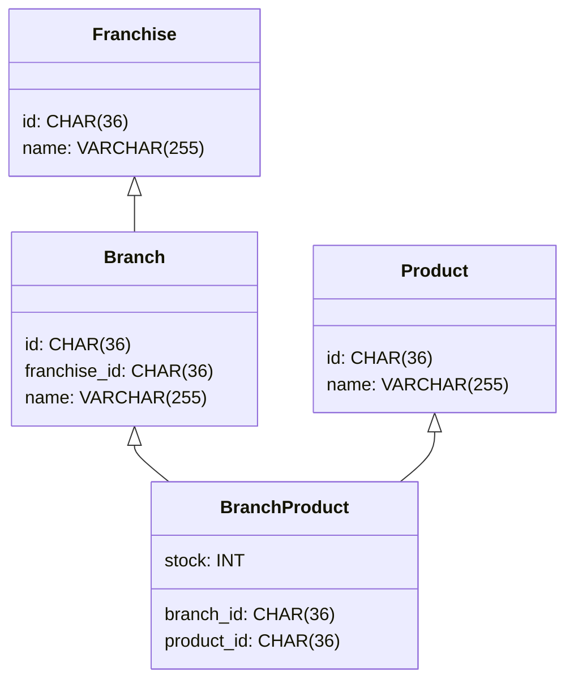

# Franchises API

## How to run the API locally

1. **Start the services (API, MySQL, Redis) using Docker Compose:**
   ```sh
   docker-compose up --build
   ```

2. **To check the information in the MySQL database:**
   ```sh
   docker exec -it mysql bash
   mysql -u root -p
   # Enter the password: root
   SHOW DATABASES;
   USE franchises;
   SHOW TABLES;
   SELECT * FROM franchise;
   exit
   exit
   ```

## Data Model



## API Endpoints

### Franchise APIs

- **Create Franchise**
  - `POST /franchises`
  - Request body:
    ```json
    {     
      "name": "Franchise Name"
    }
    ```
  - Example:
    ```sh
    curl -X POST http://localhost:8080/franchises \
      -H "Content-Type: application/json" \
      -d '{"name":"Franchise Name"}'
    ```

- **Add Branch to Franchise**
  - `POST /franchises/{franchiseId}/branches`
  - Request body:
    ```json
    {    
      "name": "Branch Name"
    }
    ```
  - Example:
    ```sh
    curl -X POST http://localhost:8080/franchises/<franchiseId>/branches \
      -H "Content-Type: application/json" \
      -d '{"name":"Branch Name"}'
    ```

- **Update Franchise Name**
  - `PATCH /franchises/{franchiseId}/name`
  - Request body:
    ```json
    {
      "name": "New Franchise Name"
    }
    ```
  - Example:
    ```sh
    curl -X PATCH http://localhost:8080/franchises/<franchiseId>/name \
      -H "Content-Type: application/json" \
      -d '{"name":"New Franchise Name"}'
    ```

- **Get Top Stocked Products per Branch**
  - `GET /franchises/{franchiseId}/top-products`
  - Example:
    ```sh
    curl -X GET http://localhost:8080/franchises/<franchiseId>/top-products
    ```

### Branch APIs

- **Update Branch Name**
  - `PATCH /branches/{branchId}/name`
  - Request body:
    ```json
    {
      "name": "New Branch Name"
    }
    ```
  - Example:
    ```sh
    curl -X PATCH http://localhost:8080/branches/<branchId>/name \
      -H "Content-Type: application/json" \
      -d '{"name":"New Branch Name"}'
    ```

- **Add Product to Branch**
  - `POST /branches/{branchId}/products`
  - Request body:
    ```json
    {
      "name": "Product Name",
      "stock": 12
    }
    ```
  - Example:
    ```sh
    curl --location 'http://localhost:8080/branches/<branchId>/products' \
      --header 'Content-Type: application/json' \
      --data '{
        "name": "Product Name",
        "stock": 12
      }'
    ```

- **Remove Product from Branch**
  - `DELETE /branches/{branchId}/products/{productId}`
  - Example:
    ```sh
    curl -X DELETE http://localhost:8080/branches/<branchId>/products/<productId>
    ```

- **Update Product Stock in Branch**
  - `PATCH /branches/{branchId}/products/{productId}/stock`
  - Request body:
    ```json
    {
      "stock": 100
    }
    ```
  - Example:
    ```sh
    curl -X PATCH http://localhost:8080/branches/<branchId>/products/<productId>/stock \
      -H "Content-Type: application/json" \
      -d '{"stock":100}'
    ```

### Product APIs

- **Update Product Name**
  - `PATCH /products/{productId}/name`
  - Request body:
    ```json
    {
      "name": "New Product Name"
    }
    ```
  - Example:
    ```sh
    curl -X PATCH http://localhost:8080/products/<productId>/name \
      -H "Content-Type: application/json" \
      -d '{"name":"New Product Name"}'
    ```

## Evolution and Quality Assurance

To further evolve and ensure the quality of this API, the following improvements could be included:

- **Authorization:** Secure endpoints with authentication and authorization mechanisms (e.g., JWT, OAuth2).
- **Integration Tests:** Add automated integration tests to verify the correct behavior of endpoints and data persistence.
- **Caching:** Implement caching strategies (e.g., using Redis) to improve performance for frequently accessed data.

I was not able to include these features due to time constraints, but they are important for production-ready systems and could be added in future iterations.
